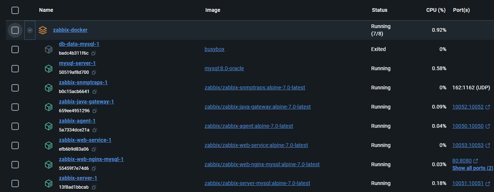
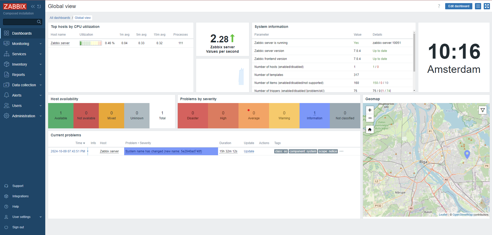
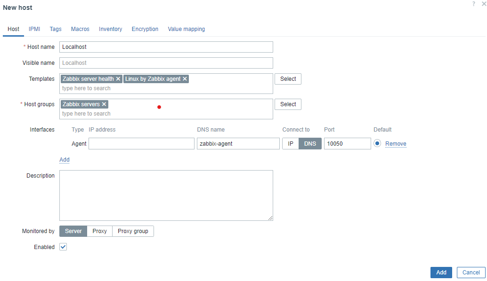
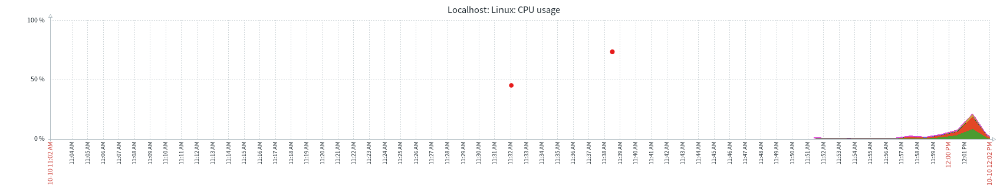

# Monitoring met Zabbix

*[Max van Oostwaard, oktober 2024.](https://github.com/hanaim-devops/devops-blog-mwoaksx)*

Monitoring is een van de cornerstones van een succesvol DevOps-proces. Zonder goede monitoring is het lastig om de prestaties en beschikbaarheid van systemen te waarborgen, wat kan leiden tot downtime of prestatieproblemen die de eindgebruiker direct beïnvloeden. 

Monitoring en de tools hiervan bieden realtime controle aan, van planning tot productie, en helpt teams snel te reageren op problemen door middel van geautomatiseerde waarschuwingen en geavanceerde visualisaties om zo het hierboven gestelde probleem te voorkomen. Het stelt developmentteams in staat om tijdig fouten te detecteren en te behandelen, wat grote problemen op omgevingen vermindert en de gebruikerservaring verhoogt (Sai, z.d.).

In deze blogpost neem ik je mee in een diepere duik op een specifieke monitoringtools genaamt Zabbix en wat deze is, hoe het je kan helpen om je systemen effectief te monitoren, en hoe je het kunt integreren in je DevOps-werkflow. Of je nu servers, databases, applicaties of netwerken moet monitoren, Zabbix biedt een veelzijdige oplossing die je processen slimmer en efficiënter maakt.

## Kort over Zabbix

Zabbix is een krachtige, open-source monitoringtool die wordt gebruikt om de prestaties, beschikbaarheid en veiligheid van IT-infrastructuren te bewaken. Of je nu de gezondheid van servers, netwerken, containers, databases of applicaties wilt monitoren, Zabbix biedt de benodigde tools om dit te doen (Zabbix-c, z.d.).

Een van de belangrijkste voordelen van Zabbix is dat het gegevens in real-time kan verzamelen. Dit betekent dat zodra een bepaalde drempelwaarde (bijvoorbeeld CPU-gebruik) wordt overschreden, Zabbix meteen een melding kan sturen. Je kunt dashboards configureren waarin je de verzamelde statistieken kunt visualiseren en bekijken. Zo kun je bijvoorbeeld in één oogopslag zien hoe goed je infrastructuur presteert en snel ingrijpen als er problemen of fouten zijn.

Zabbix ondersteunt niet alleen standaard IT-componenten zoals CPU, geheugen en netwerkverkeer, maar kan ook worden uitgebreid om applicatiespecifieke metrics te monitoren. Denk aan databasequery's of het gedrag van een specifieke microservice binnen een grotere applicatie.

In een DevOps-omgeving is Zabbix een cruciale tool omdat het je de mogelijkheid geeft om proactief te handelen. Stel dat je in het midden van een nieuwe release zit en ziet dat het geheugenverbruik te hoog wordt, dan kun je onmiddellijk actie ondernemen. Dit soort problemen vroegtijdig detecteren helpt bij het voorkomen van downtime en prestatieproblemen, wat essentieel is voor het behouden van een soepele gebruikerservaring.

Concrete monitoringtoepassingen in Zabbix:

- Servers (CPU-gebruik, geheugengebruik, schijf I/O, etc.)
- Netwerken (verkeersanalyse, pakketverlies)
- Applicaties (beschikbaarheid en prestaties van services)
- Databases (query-latenties, connecties, opslaggebruik)

## Voor- en nadelen van Zabbix

Nu we weten wat Zabbix is, is het belangrijk om te kijken naar de voor- en nadelen van deze tool, en hoe het zich verhoudt tot andere monitoringtools.

De voordelen van Zabbix:

- Gratis en Open-source: Zabbix is volledig gratis en open-source, wat betekent dat je geen licentiekosten hoeft te betalen. Dit is ideaal voor kleine bedrijven of teams met een beperkt budget die toch een robuuste oplossing nodig hebben.

- Schaalbaarheid: Zabbix is zeer schaalbaar, waardoor het geschikt is voor zowel kleine IT-infrastructuren als grote ondernemingen. Het kan kleine tot aan grootschalige systemen/applicaties monitoren en kan er tot duizenden tegelijk doen zonder dat de prestaties er aan lijden.

- Real-time Monitoring: Met Zabbix kun je real-time gegevens verzamelen en analyseren, wat je de mogelijkheid geeft om direct in te grijpen bij problemen.

- Extreem aanpasbaar: Of je nu rapportages, dashboards of meldingen wilt aanpassen, Zabbix biedt een hoge mate van flexibiliteit. Je kunt triggers instellen die specifieke acties uitvoeren wanneer bepaalde drempelwaarden worden overschreden.

- Integraties met andere tools: Zabbix integreert goed met andere tools die veel worden gebruikt in DevOps, zoals Jenkins, Ansible, en Slack. Hierdoor kun je meldingen ontvangen, automatisch tests starten, of bepaalde taken automatiseren.

De nadelen van Zabbix:

- Complexe Configuratie: Zabbix is voor een beginner erg lastig op te pakken. Zabbix is over het algemeen moeilijk op te zetten, vooral als je niet veel ervaring hebt met monitoringtools. Het installeren en configureren van Zabbix vereist technische kennis en een goed begrip van je infrastructuur.

- Steile leercurve: De vele opties en functies in Zabbix maken het een krachtig platform, maar dat betekent ook dat de leercurve steil kan zijn, vooral voor beginners. Het kan even duren voordat je gewent raakt & voldoende kennis hebt over alle opties, functies en instellingen.

- Interface: De interface van Zabbix is functioneel maar minder intuïtief dan die van commerciële oplossingen zoals Datadog of Grafana, vooral voor gebruikers die gewend zijn aan meer moderne UI’s.

## Monitoren met Zabbix

Zabbix biedt dus mogelijkheid om infrastructuren en systemen erg breedt te monitoren. Om hier een kleine visualisatie van te geven, geef ik een praktisch voorbeeld over hoe je Zabbix kunt inzetten om je localhost te monitoren.

Maar waarom localhost? Een monitoringtool zoals Zabbix draait eigenlijk altijd op een server en kan vanaf daar verschillende infrastructuren & systemen in de gaten houden. Maar wat als je, net zoals ik, geen toegang hebt tot een server? Dan wordt het lastig om de gezondheid en prestaties van deze systemen bij te houden. Gelukkig kun je ook je localhost monitoren met Zabbix! Aangezien elk apparaat over een localhost beschikt, is dit een ideale vervanging voor een echte server. Dit is ook een eenvoudige manier om kort in aanraking te komen met Zabbix

### Zabbix opzetten

In dit voorbeeld kiezen we ervoor om Zabbix eenvoudig op te zetten via Docker Compose. Dit voorkomt dat Zabbix lokaal geïnstalleerd hoeft te worden. Alle benodigde bestanden hiervoor zijn te vinden in de officiële Zabbix GitHub repository. We klonen deze repository met het volgende commando in de terminal: `git clone https://github.com/zabbix/zabbix-docker.git`

Nadat de repository is gekloond, navigeren we naar versie 7.0, mocht je nog niet automatisch in de juiste versie zitten: `git checkout 7.0`.

De repository bevat Docker Compose-bestanden, Dockerfiles en omgevingsvariabelen die klaar zijn voor gebruik. Mocht je specifieke configuraties willen aanpassen, dan kun je de benodigde bestanden kopiëren naar je eigen project en aanpassen waar nodig.

Binnen de repository vind je meerdere Docker Compose-bestanden, elk geschikt voor verschillende opstellingen van Zabbix. De naam van elk bestand geeft informatie over hoe Zabbix draait. Bijvoorbeeld, de naam `docker-compose_v3_alpine_mysql_latest` kan als volgt worden ontleed:

- `docker-compose_v3`: Specificeren van het gebruik van Docker Compose versie 3.
- `alpine`: Geeft aan dat de services draaien op Alpine Linux
- `mysql`: Zabbix maakt in dit geval gebruik van een MySQL-database voor de opslag haar data
- `latest`: Alle services draaien op de nieuwste beschikbare versie

Voor dit voorbeeld gebruiken we ook dit specifieke Docker Compose-bestand. Start Zabbix met het volgende commando:
`docker compose -f ./docker-compose_v3_alpine_mysql_latest.yaml --profile full up -d`

Dit Docker Compose commando heeft 2 opties waar we vooral op moeten letten:

- De `-f` optie geeft het pad naar het juiste Docker Compose-bestand
- De `--profile` optie kan worden gebruikt om verschillende services in te schakelen op basis van hun profielen (Docker, z.d.). In ons geval gebruiken we het full profiel om alle benodigde services op te starten

Het binnenhalen en opstarten van de Zabbix services kan even duren. Zodra alles is opgezet, kun je via Docker Desktop controleren of alle containers actief zijn. Je zou iets moeten zien zoals hieronder in figuur 1:

*Figuur 1*: Zabbix containers in Docker Desktop

 

De containers hebben elk hun eigen rol binnen Zabbix. Voor dit voorbeeld is niet elke container relevant en worden er een paar ook niet zelfbewust door ons gebruikt. Voor dit voorbeeld zijn vooral de volgende containers relevant:

- `Zabbix-web-nginx`: Dit is de webinterface van Zabbix
- `zabbix-server`: Het centrale procces van de Zabbox software die alle gegevens beheert en verwerkt (Zabbix-a, z.d.)
- `zabbix-agent`: Deze agent monitort lokale bronnen en stuurt gegevens door naar de server (Zabbix-b, z.d.).

Ga nu naar `localhost:80` in je browser, waar je het dashboard van Zabbix zou moeten zien zoals in figuur 2.

*Figuur 2*: Zabbix dashboard</i>

 

Gefeliciteerd, je hebt Zabbix succesvol opgestart! Er staat al een hoop informatie op je scherm, hier hoef je niets aan te veranderen of aan te komen.

### Aanmaken van een Hosts

Om Zabbix daadwerkelijk te laten monitoren, moeten we een "host" toevoegen. In dit voorbeeld willen we de localhost monitoren. In Zabbix vertegenwoordigt een host een infrastructuur, systeem of applicatie. We beginnen met het aanmaken van een host. Navigeer via de zijbalk naar `Datacollection` -> `Hosts`. Dit scherm toont een overzicht van alle bestaande hosts.

Waarschijnlijk zie je al een host die automatisch is aangemaakt. Deze kun je negeren, verwijderen of disabelen (deze optie heeft de voorkeur). Klik rechtsboven om een nieuwe host aan te maken en vul de volgende gegevens in bij het eerste tabje die je ziet. De rest van de tabjes en/of opties noef je niks mee te doen.

- Hostname: `Localhost`
- Templates:
  - Select -> `Templates` -> `Zabbix server health`
  - Select -> `Templates/Operation systems` -> `Linux by Zabbix agent`
- Host groups: `Zabbix servers`
- Interfaces:
  - Add -> `Agent`
  - Ip Adress weghalen
  - DNS name -> `zabbix-agent`
  - Connect to -> `DNS`
  - Port -> `10050` (de standaardpoort voor de Zabbix-agent die we hebben opgestart).

Je invoer zou er ongeveer uit moeten zien zoals in figuur 3:

*Figuur 3*: Creëren van host in Zabbix

 

Klik nu op `Add` om de host toe te voegen.

Het kan even duren voordat de host beschikbaar is. Zodra de host is herkend, zou het `Availability` vakje groen moeten worden. Refresh de pagina of wissel tussen schermen als dit te lang duurt.

*Figuur 4*: Een actieve host in Zabbix

 

Als je host actief is, kun je via `Monitoring` -> `Hosts` naar de host gaan en klikken op `Graphs`. Hier zie je diverse grafieken met realtime statistieken van de localhost. Een voorbeeld is de `CPU usage` grafiek. Start een aantal extra Docker containers op om te zien hoe de grafiek reageert; het CPU-gebruik zal stijgen wanneer je nieuwe containers opstart.

*Figuur 5*: CPU usage grafiek in Zabbix

 

In dit voorbeeld hebben we Zabbix succesvol opgezet met Docker Compose en een nieuwe host aangemaakt om de localhost te monitoren. We hebben de basisprincipes van het gebruik van Zabbix besproken, zoals het kiezen van de juiste Docker Compose-opstelling, het starten van de services, en het configureren van een host voor monitoring. Vervolgens hebben we met behulp van Zabbix-agent de prestaties van de server, zoals het CPU-gebruik, inzichtelijk gemaakt met behulp van grafieken.

Als je verder wilt duiken in Zabbix en geavanceerde functies zoals geautomatiseerde triggers, aangepaste templates, of integraties met andere DevOps-tools of het customizeren van dashboards, raad ik aan om de uitgebreide [Zabbix documentatie](https://www.zabbix.com/documentation) te raadplegen.

## Waarom Zabbix binnen DevOps workflow's?

Zabbix biedt uitgebreide mogelijkheden voor real-time monitoring en automatisering, wat perfect aansluit bij een DevOps-werkflow waarin snelle feedback en continue integratie essentieel zijn. Met Zabbix kun je gemakkelijk de prestaties van je applicaties monitoren, waardoor je snel kunt zien of er problemen zijn na bijvoorbeeld een nieuwe release (Sanders, 2024).

Een belangrijk onderdeel van Zabbix is de mogelijkheid om het te integreren met andere tools die vaak binnen DevOps worden gebruikt, zoals Jenkins voor CI/CD-pipelines (Feltrin, 2018). Stel je voor dat je een nieuwe versie van je applicatie uitrolt. Zabbix kan meteen gaan monitoren of de nieuwe versie correct werkt en of er geen onverwachte fouten optreden. Als Zabbix een probleem detecteert, kan het automatisch een terugrolplan in gang zetten, of je waarschuwen via een tool zoals Slack, zodat je direct kunt reageren.

De mogelijkheid om triggers in te stellen zorgt ervoor dat teams niet constant handmatig hun systemen in de gaten hoeven te houden. Als er bijvoorbeeld een probleem optreedt in de infrastructuur, zoals een server die overbelast raakt of een database die niet meer reageert, kan Zabbix automatisch meldingen sturen, systemen herstarten, of schalingstaken uitvoeren. Hierdoor verloopt het beheer van de infrastructuur veel soepeler en kunnen problemen worden opgelost voordat ze een impact hebben op de eindgebruikers.

## Conclusie

In deze blog hebben we de veelzijdigheid en kracht van Zabbix als monitoringtool binnen DevOps-omgevingen verkend. We hebben gezien hoe eenvoudig het is om Zabbix op te zetten met Docker Compose en hoe je een nieuwe host kunt configureren om je localhost te monitoren. Door middel van grafieken hebben we de prestaties van de server in realtime kunnen volgen, wat ons waardevolle inzichten biedt.

Zabbix stelt teams in staat om proactief te reageren op incidenten en zorgt voor een efficiënter beheer van infrastructuur en applicaties. De mogelijkheid om Zabbix te integreren met andere DevOps-tools zoals Jenkins versterkt het hele CI/CD-proces, wat resulteert in snellere feedback loops en verbeterde samenwerking.

Hoewel de leercurve van Zabbix erg hoog is en het voor beginners begrijpelijk is om een andere optie te kiezen, heb je met Zabbix een krachtig hulpmiddel in handen om je DevOps-praktijken naar een hoger niveau te tillen en ervoor te zorgen dat je applicaties altijd optimaal presteren.

## Bronnen

- Sai, K. (z.d.). *DevOps-Monitoring | Atlassian*. Atlassian. Geraadpleegd op 9 oktober 2024, van <https://www.atlassian.com/nl/devops/devops-tools/devops-monitoring>
- Docker. (z.d.). *“Use service profiles”*. Docker Documentation. Geraadpleegd op 10 oktober 2024, van <https://docs.docker.com/compose/how-tos/profiles/>
- Feltrin, J. M. (2018, 29 april). *Monitoring Jenkins Jobs with zabbix LLD - Jean Michel Feltrin - Medium*. Medium. Geraadpleegd op 10 oktober 2024, van <https://medium.com/@feltrin/monitoring-jenkins-jobs-with-zabbix-lld-3a19233e54b8>
- Sanders, K. (2024, 2 oktober). *DevOps Automation: A Complete Guide to Efficient Development*. The CTO Club. Geraadpleegd op 10 oktober 2024, van <https://thectoclub.com/development-devops/devops-automation/>
- Zabbix. (z.d.-a). *Zabbix Documentation | 1 Server*. Geraadpleegd op 10 oktober 2024, van <https://www.zabbix.com/documentation/current/en/manual/concepts/server>
- Zabbix. (z.d.-b). *Zabbix Documentation | 2 Agent*. Geraadpleegd op 10 oktober 2024, van <https://www.zabbix.com/documentation/current/en/manual/concepts/agent>
- Zabbix. (z.d.-c). *Zabbix Documentation | 2 What is Zabbix*. Geraadpleegd op 10 oktober 2024, van <https://www.zabbix.com/documentation/current/en/manual/introduction/about>
